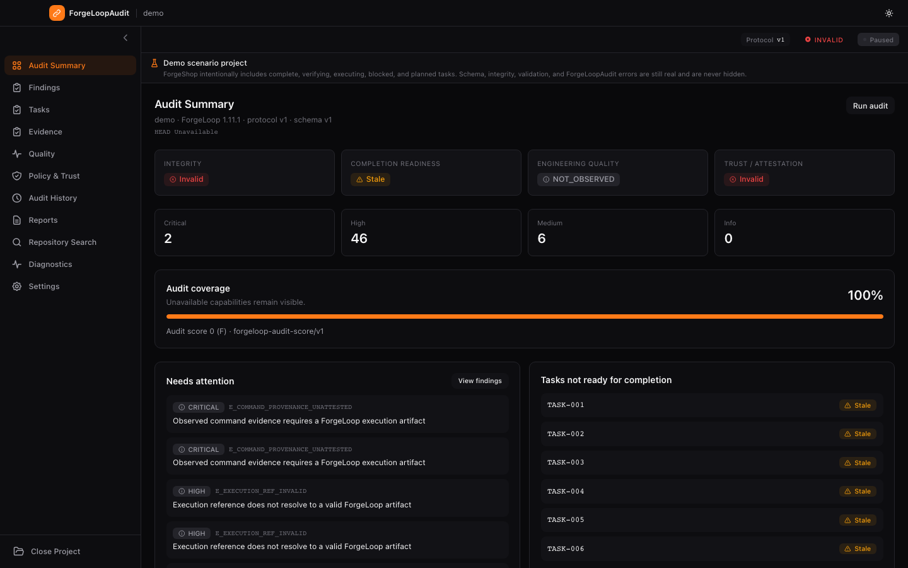
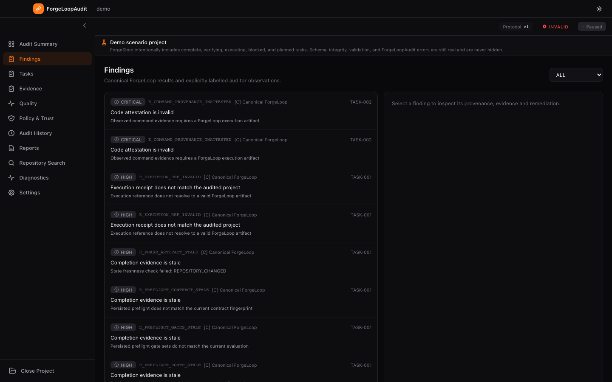
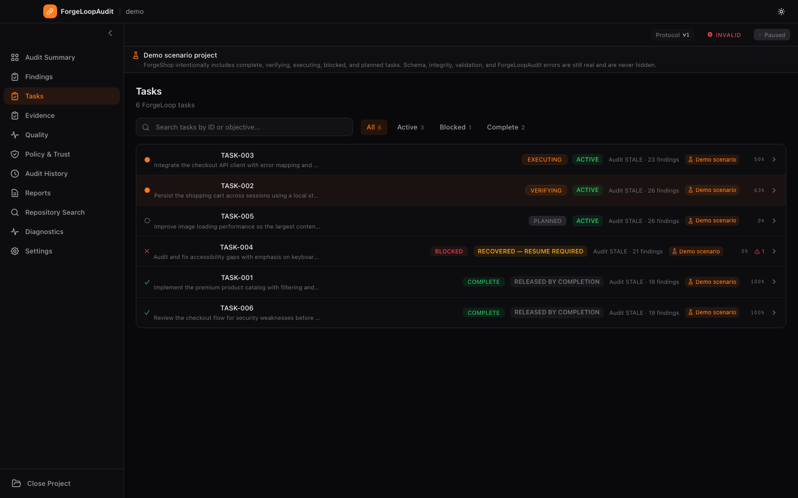
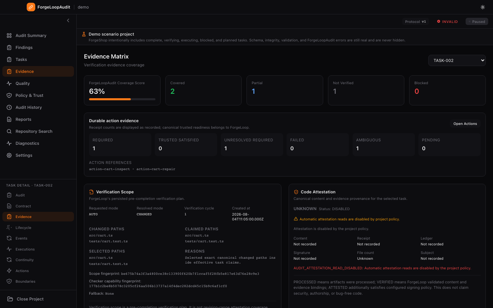
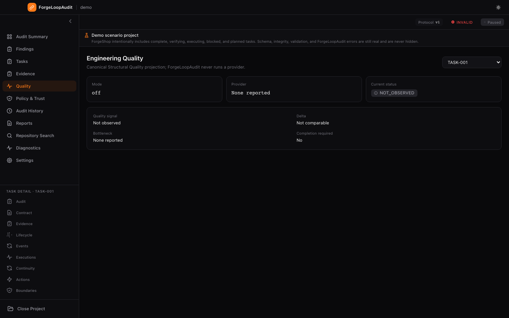
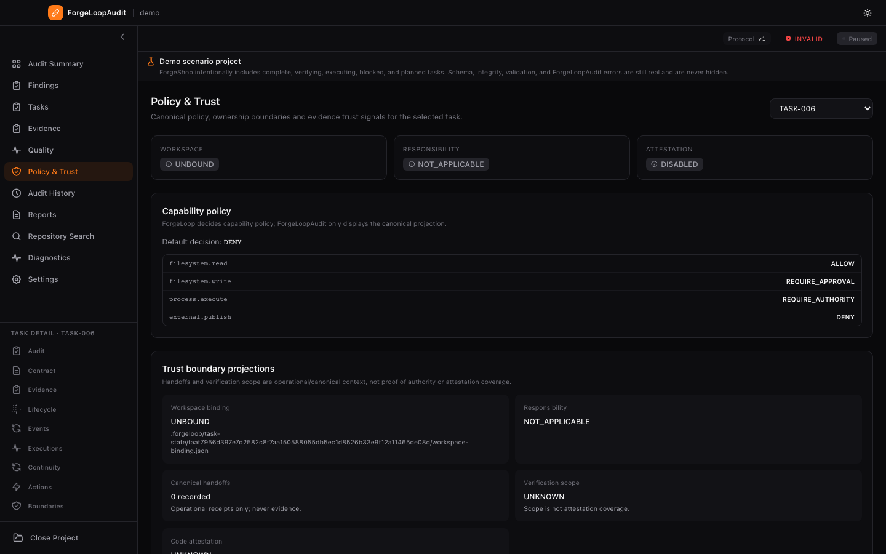
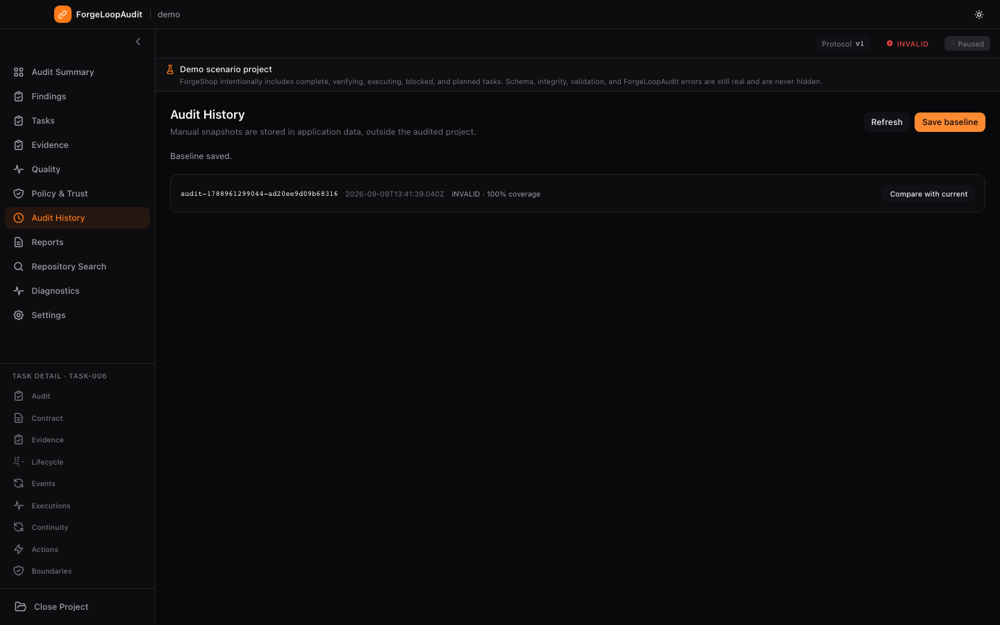
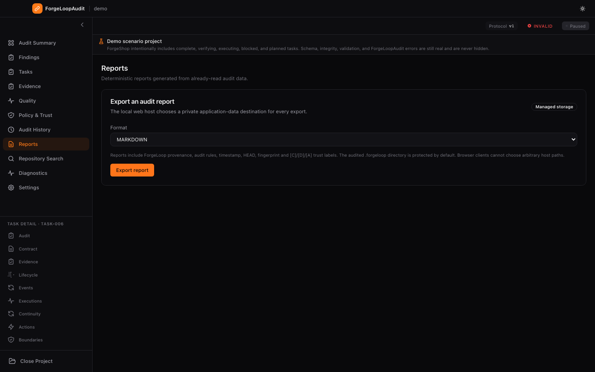

# ForgeLoopAudit

> A local-first, read-only engineering auditor for ForgeLoop projects.

ForgeLoopAudit runs a loopback Node.js web server and opens a browser-based
interface for inspecting canonical ForgeLoop state, bounded protocol artifacts,
findings, coverage, history and reports. ForgeLoop remains the protocol
authority and `.forgeloop/` remains the source of truth.

## Current release

The current release candidate is `v0.3.0-rc.1`, aligned to vendored ForgeLoop `1.11.1` at immutable source commit
`674f12c006b3ace12278f109b7ae24f57012d09c` (protocol v1, schema v1 and
Integration API v1). The vendored archive and schema provenance are checked by
`npm run verify:forgeloop-lineage` and `npm run protocol:schemas:verify`.

The release is an unsigned preview. Checksums, the lockfile SBOM and exact
source lineage are verification artifacts; none of them implies signing,
notarization, publication or production deployment.

## Trust model

ForgeLoopAudit reads canonical Integration API resources and bounded artifacts
through a narrow, read-only boundary. It never changes claims, ownership,
workspaces, handoffs, responsibility, verification scope or attestations, and
it never executes mutable ForgeLoop commands. Canonical handoff acceptance is
immutable, exactly-once and ledger-backed in ForgeLoop; the auditor shows it as
an operational receipt only: it is not evidence, authority, delegation
or completion state. Missing optional capabilities remain unavailable rather
than being inferred.

Canonical ForgeLoop results, deterministic ForgeLoopAudit-derived findings and
local application observations are labelled separately. The optional advisory context
capability is host-provided metadata only; advisory context is
host-provided metadata only; the auditor does not load memory or invoke recall.
Repository Index/Search is an engineering discovery surface only, never audit
evidence or lifecycle authority.

## Run the web interface

```bash
npm ci
npm run build:web
node dist/server/cli.mjs --demo
```

The server binds to loopback only and prints a one-time same-origin bootstrap
URL. To inspect another local project, start the server with an explicit path:

```bash
node dist/server/cli.mjs --project /path/to/project
```

Project selection and filesystem access stay with the local CLI/server. The
browser does not upload folders or choose arbitrary host paths. Recent projects
may be reopened only when the local server owns the recent-project record.

Application data is stored outside the audited repository: macOS uses
`~/Library/Application Support/ForgeLoopAudit`, Windows uses `LOCALAPPDATA`,
and Linux uses `XDG_STATE_HOME` or `~/.local/state`. Set
`FORGELOOP_AUDIT_DATA_DIR` for an isolated local run.

## Web interface

The renderer uses code-owned shadcn-style primitives for buttons, cards, badges,
inputs, separators and theme controls. See [shadcn/ui](https://ui.shadcn.com/)
for the composable component approach. Dark mode is the default; the Settings
page and title-bar control support dark, light and system themes.

The main surfaces are Audit Summary, Findings, Tasks, Evidence, Quality, Policy
& Trust, Audit History, Reports, Repository Search, Diagnostics and Settings.
Repository search is explicitly marked **Discovery only**. Report exports are
written by the local server to managed application storage, not to a browser-
chosen destination.

## Demo project

The generated [`demo/`](./demo) directory is the schema-valid ForgeShop fixture
used by screenshots and browser smoke tests. It contains six intentional
scenarios: complete, verifying, executing, blocked/recovery, planned and
security-policy work. Real schema, artifact, gate, integrity and policy errors
remain real failures.

| Task | Demonstrates |
|---|---|
| TASK-001 | Complete lifecycle and unsigned attestation artifacts |
| TASK-002 | Verification/review and `AUTO` → `CHANGED` scope |
| TASK-003 | Execution, workspace binding and responsibility constraints |
| TASK-004 | Recovery, continuity and canonical handoff receipt |
| TASK-005 | Planned performance work |
| TASK-006 | Security policy and successful completion |

Regenerate and verify the fixture with:

```bash
npm run demo:generate
npm run demo:verify
```

## Screenshots

The images below are captured from the production renderer through the local
web server at 1440 × 900 in the default dark theme.

| Audit Summary | Findings | Tasks |
|---|---|---|
|  |  |  |
| Evidence | Quality | Policy & Trust |
|  |  |  |
| Audit History | Reports | Diagnostics |
|  |  |  |
| Settings | | |
|  | | |

Regenerate and check the set with:

```bash
npm run screenshots:readme
npm run screenshots:check
```

See [`screen/README.md`](screen/README.md) for the capture contract.

## Verification

Use the smaller development gates while iterating:

```bash
npm run typecheck
npm run lint
npm test
npm run test:web-smoke
```

The complete contract is:

```bash
npm run verify:full
```

It covers dependency policy, production audit, vendored lineage, schema and
demo verification, documentation, typechecking, lint, unit tests, coverage,
performance, the web build and package contents. CI runs the contract on
Ubuntu, macOS and Windows, then runs the Playwright browser smoke suite.

## Documentation

Start with the [documentation index](docs/README.md), the [current
implementation specification](FORGELOOP_AUDIT_IMPLEMENTATION_SPEC.md) and the
[web migration report](docs/migration/WEB_IMPLEMENTATION_REPORT.md). The
[migration baseline](docs/migration/WEB_BASELINE.md) is a historical pre-web
record and intentionally retains its old Electron-era values.

## ForgeLoop

ForgeLoopAudit is a companion project for [ForgeLoop](https://github.com/cassiomc1/forgeloop).
