# ForgeLoop Studio

> **A real-time visual interface for the ForgeLoop engineering protocol.**

ForgeLoop Studio is a local-first, read-only desktop visualizer for ForgeLoop.
Open a ForgeLoop-enabled project and inspect canonical tasks, lifecycle phases,
contracts, routing, gates, checks, evidence, recovery, continuity, policy and
execution-profile context and provenance in real time. ForgeLoop remains the
protocol authority; Studio is a visual consumer of the state that ForgeLoop
exposes.

## Trust model

Studio never changes protocol claims, binds workspaces, creates handoffs, sets
responsibility, computes or persists verification scope, creates or signs
attestations, or becomes task authority. It reads canonical Integration API
resources and bounded artifacts through a narrow, read-only boundary. Missing
optional capabilities remain unavailable instead of being inferred, and
recovery, action and verification decisions are displayed as read-only
information. A canonical handoff acceptance is displayed as an operational
receipt only; it transfers no claims, evidence or authority.

## Screenshots

| Overview | Tasks | Lifecycle flow |
|---|---|---|
| 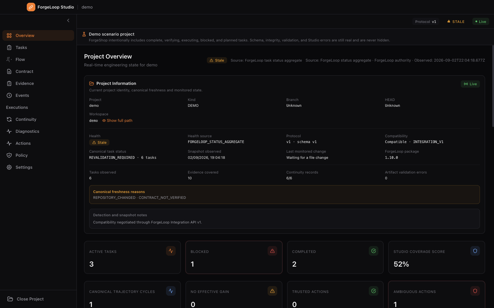 | 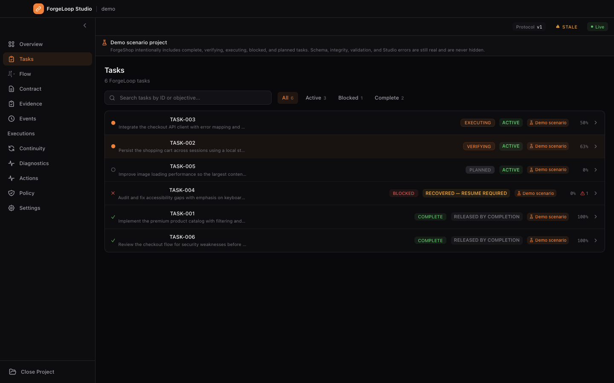 | 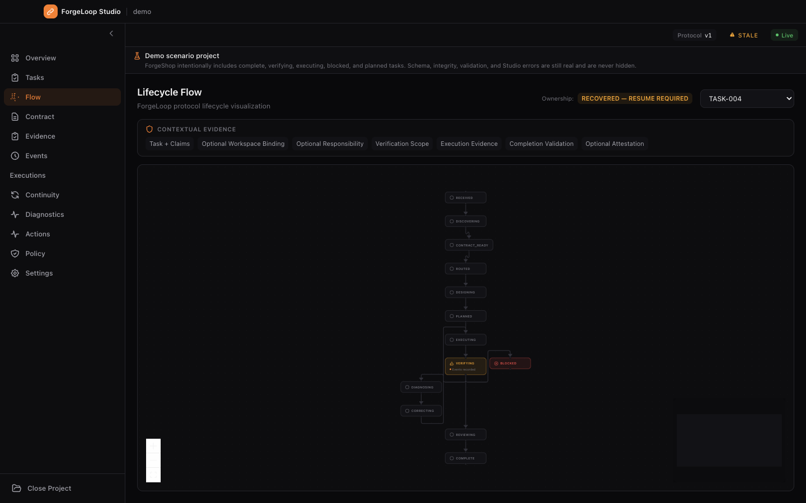 |
| Contract inspector | Evidence matrix | Event ledger |
| 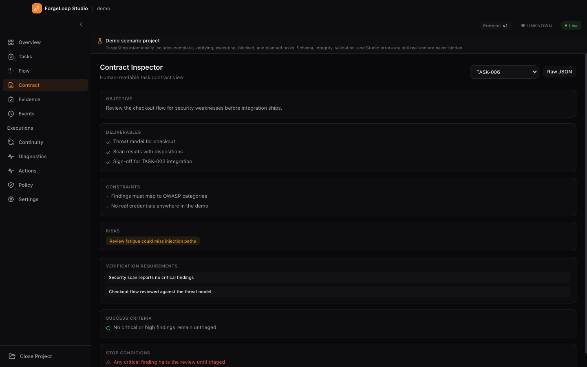 | 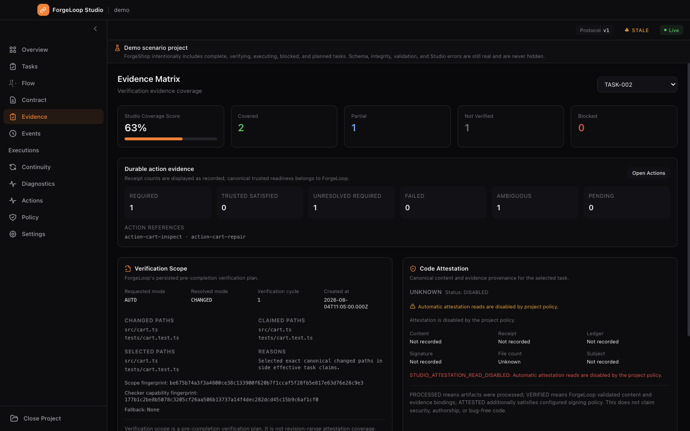 | 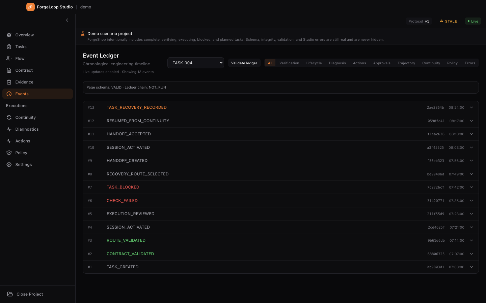 |
| Continuity | Diagnostics | Actions |
| 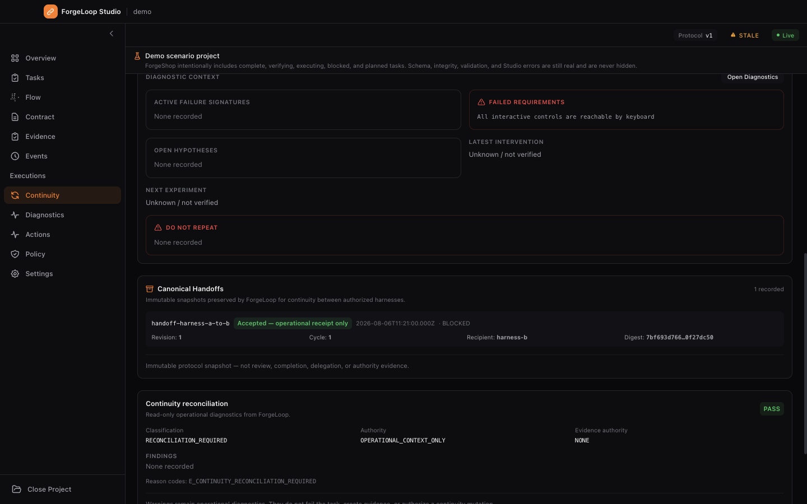 | 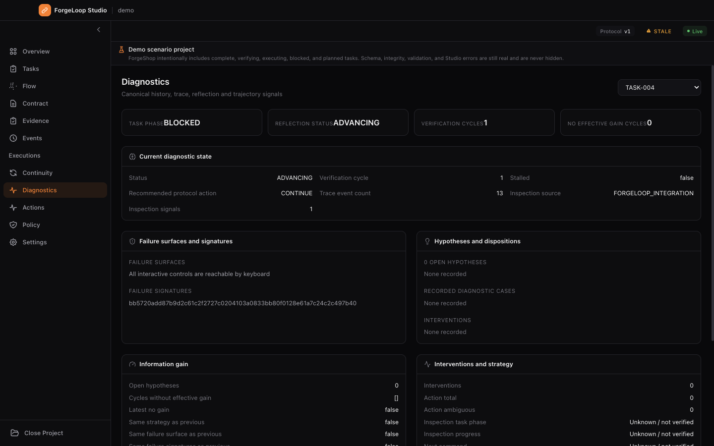 | 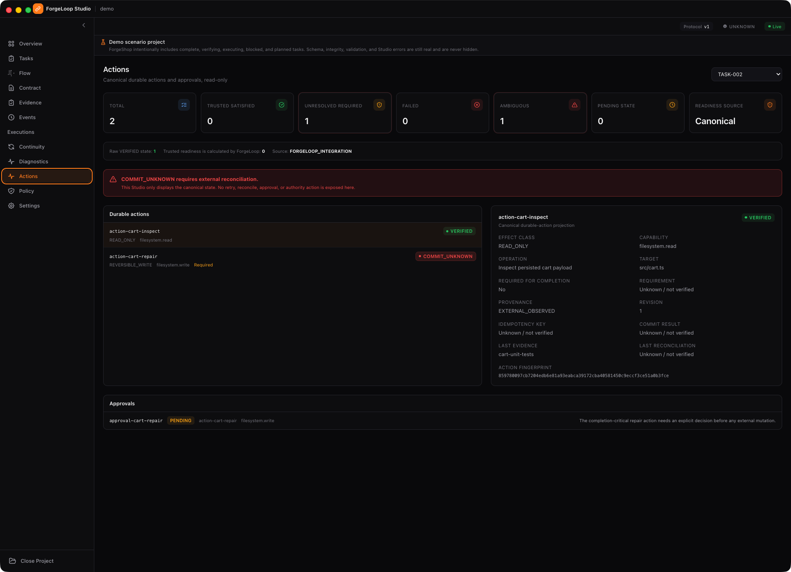 |
| Policy | Settings | |
| 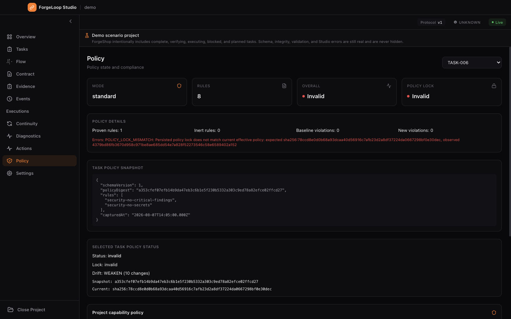 | 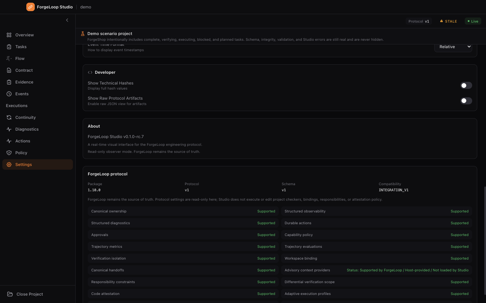 | |

### ForgeLoop 1.10.0 advisory context, exactly-once handoffs, and trust-boundary surfaces

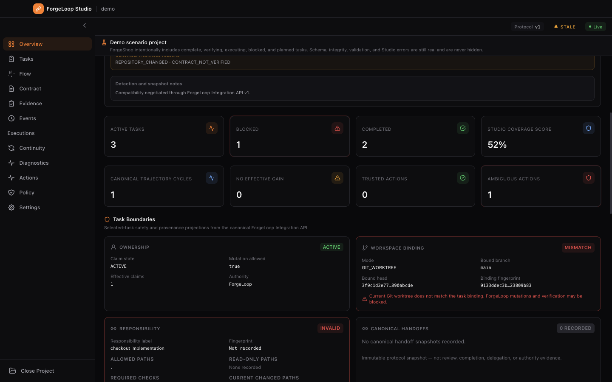

The captures come from the generated ForgeShop fixture and the production
renderer build. See the [screenshot source and review guide](screen/README.md)
for mappings and the regeneration policy.

## Project selection

Use **Open ForgeLoop Project** to select either a ForgeLoop project directory
or a parent folder that contains one. If the selected folder is not itself a
project, Studio searches its accessible subfolders recursively for a
`.forgeloop/config.json` project marker.

When exactly one project is found, Studio opens it automatically. If several
projects are found, Studio stops and asks you to select one project directory
directly instead of choosing an arbitrary result. Symlinked subdirectories and
common dependency/build folders are not followed during discovery.

## Current status

The current release line is `v0.1.0-rc.7`. The read-only Studio runtime,
trusted protocol validation, functional fixture E2E and multi-platform release
staging are implemented. This release line is aligned to the vendored ForgeLoop
`1.10.0` Integration API v1 (canonical ownership, durable recovery,
observability, durable actions, approvals, capability policy, trajectory
metrics, evaluations, verification-execution provenance, workspace binding,
canonical handoffs, responsibility constraints, differential verification scope
code attestation, adaptive execution-profile context, exactly-once handoff
acceptance and provider/host-reported efficiency observability). The protocol,
schema and Integration API remain v1.

For the current release-candidate policy, Linux, macOS and Windows builds are unsigned preview artifacts. Validate the published checksums and expect normal operating-system security warnings; signed/notarized distribution is not part of this release candidate.

## Stack

- Electron
- Node.js 20+
- TypeScript
- React
- Vite
- Tailwind CSS
- React Flow
- Chokidar
- Ajv
- Vitest
- Playwright
- `@cassiomc1/forgeloop` 1.10.0 (vendored from the trusted source commit in `schemas/provenance.json`, read-only)

## Product direction

ForgeLoop Studio is designed as a **read-only observer by default**. ForgeLoop remains the protocol authority and `.forgeloop/` remains the canonical source of truth.

## Current ForgeLoop compatibility

The current vendored ForgeLoop baseline is ForgeLoop `1.10.0` at immutable source commit `3bf721bac6a09c6291bfcbc507a66a2833ebddf4` (protocol v1, schema v1, Integration API v1).

Studio consumes the bundled `@cassiomc1/forgeloop/integration` public subpath as its semantic boundary: canonical task discovery, canonical claim ownership (`claimState`, `mutationAllowed`, `ownershipValid`, historical vs effective write claims), durable recovery state, execution provenance, observability projections, durable actions, approvals, capability policy, trajectory metrics, trajectory evaluations, workspace binding, canonical handoffs, responsibility constraints, differential verification scope and code attestation. Direct `.forgeloop/` artifact reading remains available for bounded detail views and diagnostics only — it never determines current ownership, action readiness or authority. The Studio never executes mutable ForgeLoop commands; recovery/resume and action decisions are displayed as copy-only/read-only information.

The Diagnostics, Actions, verification-execution provenance, adaptive execution-profile context, Structural Quality resource, and 1.10.0 boundary views are explicitly capability-negotiated. Missing optional resources degrade the affected feature to an honest **unavailable** state while retaining `INTEGRATION_V1`; `COMMIT_UNKNOWN`, unresolved requirements and unknown usage remain visible rather than being inferred or silently reconciled. The Integration API advertises `canonicalHandoffs v2` with immutable, exactly-once, ledger-backed acceptance and `advisoryContextProviders v1` with provider-neutral, lazy, opt-in, non-persisted, non-authoritative and non-executable trust rules. Studio displays an accepted handoff as an operational receipt only and never creates bindings, handoffs, scopes, attestations or execution sandboxes. Advisory context is host-provided and is not loaded by Studio; Studio never exposes memory counts, retrieved results or automatic recall. Workspace status, responsibility constraints, immutable handoffs, persisted verification scope, attestation status and bounded context policy are read lazily for the selected task. Studio displays the isolation, attestation and execution-profile metadata persisted by ForgeLoop and never creates or signs attestations. It may request ForgeLoop's canonical local content verification when no external signing-provider execution is required; external signing-provider verification is never triggered automatically. Verification scope is not attestation coverage, handoff snapshots and acceptance receipts are not evidence, context inflation and efficiency regression are observational diagnostics, and the capability policy is displayed as project policy context; it never grants host authority to Studio.

Compatibility modes: `INTEGRATION_V1` (full support), `ARTIFACT_ONLY` (visual reading with ownership unavailable; also the degraded mode for ForgeLoop <= 1.3 projects), and `INCOMPATIBLE` (fail closed). There is deliberately no inferred legacy mode — without an explicit project-level signal, downgrading a broken integration into "legacy" would mask regressions. See [docs/PROTOCOL_COMPATIBILITY.md](docs/PROTOCOL_COMPATIBILITY.md) for the full matrix.

The visual direction is a premium, modern, minimal dark developer interface focused on clarity rather than decorative effects.

## Demo project

ForgeLoop Studio includes a complete, schema-valid ForgeLoop demo project under [`demo/`](./demo) — **ForgeShop**, a fictional premium e-commerce application built through ForgeLoop. Open it directly from Studio (choose **Open Demo Project** on the start screen) or select the `demo/` directory manually to explore tasks, execution flow, contracts, evidence, continuity, policy, recovery, diagnostics, durable actions and verification without configuring another repository.

The demo is a real ForgeLoop project fixture: every `.forgeloop/` artifact validates against the same trusted protocol schemas Studio enforces for any other project, and it passes through the normal ProjectDetector → PathBoundary → SchemaValidator pipeline. No external service, network access or build step is required. The bundled demo also ships inside release builds and doubles as an end-to-end regression fixture.

| Task | Demonstrates |
|---|---|
| TASK-001 | Complete successful lifecycle |
| TASK-002 | Verification/review in progress |
| TASK-003 | Active execution and responsibility constraints |
| TASK-004 | Durable recovery (resume required) and cross-harness continuity |
| TASK-005 | Planned performance work |
| TASK-006 | Security policy and successful completion |

Studio labels these known states as intentional demo scenarios: the start screen explains them before opening, a persistent **Demo scenario project** banner is shown while ForgeShop is open, and each known task exposes an explanatory badge. A known task drifting to an unexpected phase is surfaced as **Demo drift**. The scenario label never suppresses real errors — schema, artifact, gate, integrity, policy, IPC and Studio failures are always reported normally (see [`demo/README.md`](./demo/README.md)).

Regenerate it with `npm run demo:generate` (deterministic; CI fails on drift via `demo:generate --check`) and validate it with `npm run demo:verify`.

## Implementation specification

See [`FORGELOOP_STUDIO_IMPLEMENTATION_SPEC.md`](./FORGELOOP_STUDIO_IMPLEMENTATION_SPEC.md) for the complete architecture, security model, UI system, data model, feature scope, testing strategy, implementation order and MVP definition of done.

## Documentation

Use [`docs/README.md`](docs/README.md) as the documentation index. It maps
current product, protocol, operational, release and trust-boundary guidance to
its canonical implementation source and identifies historical records.

## Roadmap

Future work is intentionally separate from the current read-only release
surface: historical replay, richer task comparison and analytics, optional Git
context, exportable engineering reports and an explicitly separated operator
mode remain candidates. None of these are required for Studio to remain a
read-only visual consumer.

## Contributing

Keep current documentation aligned with the canonical implementation sources,
preserve historical records, and run `npm run docs:check` together with the
relevant validation gates before opening a pull request.

## ForgeLoop

ForgeLoop Studio is a companion project for [ForgeLoop](https://github.com/cassiomc1/forgeloop).

## Development

```bash
npm ci
npm run dev
```

Use `npm run verify` for typecheck, tests and a deterministic production build. See [docs/TROUBLESHOOTING.md](docs/TROUBLESHOOTING.md) for packaged macOS diagnostics and CLI/runtime limitations.

Use `npm run verify:full` for the complete release verification contract. It includes release-version lineage validation and requires access to the configured Git release remote; it fails closed when the remote tag namespace cannot be queried. `npm run verify` remains available for ordinary offline development verification.

Use `npm run audit:prod` to block high/critical production dependency advisories. `npm audit` may still report development-tool findings; the current production audit is clean.

Release staging generates `SHA256SUMS-*` after selecting the public distributables, so each published checksum covers only files present in the corresponding GitHub Release asset set. The Overview health panel separates authoritative protocol health from Studio observations such as task count, evidence coverage and continuity records.

Use `npm run test:electron-smoke` for source/built Electron smoke and `npm run test:packaged-smoke` to build and launch the electron-builder unpacked application. When ForgeLoop CLI is unavailable, Studio remains readable in explicit artifact-only compatibility mode.
