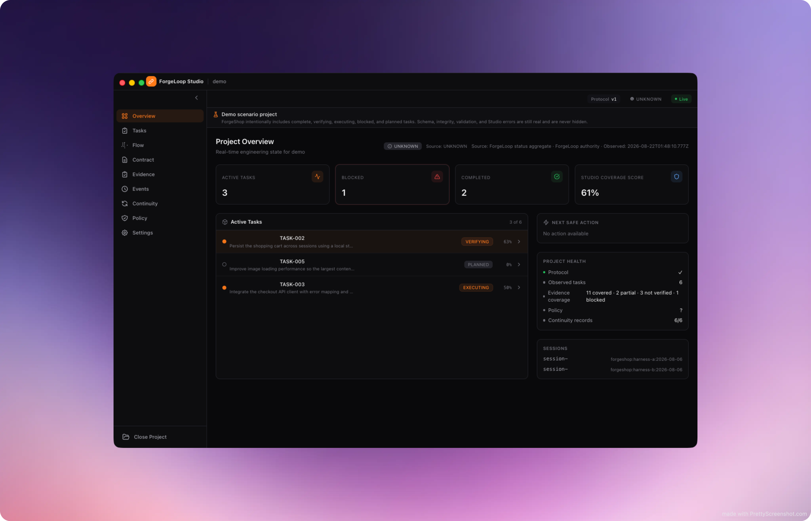

# ForgeLoop Studio

> **A real-time visual interface for the ForgeLoop engineering protocol.**

ForgeLoop Studio is a local-first desktop companion for ForgeLoop. Open a ForgeLoop-enabled project and visualize tasks, lifecycle phases, contracts, routing, gates, checks, evidence, recovery cycles, continuity, policy state and completion health in real time.

## Screenshots

| | |
|---|---|
|  | .png) |
| .png) | .png) |
| .png) | |

## Status

Release candidate — the read-only Studio runtime, trusted protocol validation, functional fixture E2E and multi-platform release staging are implemented. The current development target is `v0.1.0-rc.5`; RC3 remains immutable at its tagged commit and represents the earlier release configuration without pre-publication semantic evidence validation. Semantic release-evidence hardening is first included in RC4.

For the current RC4 policy, Linux, macOS and Windows builds are unsigned preview artifacts. Validate the published checksums and expect normal operating-system security warnings; signed/notarized distribution is not part of this release candidate.

## Stack

- Electron
- Node.js 20+
- TypeScript
- React
- Vite
- Tailwind CSS
- React Flow
- Chokidar
- Ajv
- Vitest
- Playwright
- `@cassiomc1/forgeloop` 1.5.x (bundled Integration API, read-only)

## Product direction

ForgeLoop Studio is designed as a **read-only observer by default**. ForgeLoop remains the protocol authority and `.forgeloop/` remains the canonical source of truth.

## ForgeLoop 1.5 compatibility

Studio consumes the bundled `@cassiomc1/forgeloop/integration` public subpath as its semantic boundary: canonical task discovery, canonical claim ownership (`claimState`, `mutationAllowed`, `ownershipValid`, historical vs effective write claims), durable recovery state and execution provenance. Direct `.forgeloop/` artifact reading remains available for detail views and diagnostics only — it never determines current ownership. The Studio never executes mutable ForgeLoop commands; recovery/resume actions are displayed as copy-only instructions.

Compatibility modes: `INTEGRATION_V1` (full support), `ARTIFACT_ONLY` (visual reading with ownership unavailable), `LEGACY_CLI_READ_ONLY` (ForgeLoop <= 1.3), and `INCOMPATIBLE` (fail closed). See [docs/PROTOCOL_COMPATIBILITY.md](docs/PROTOCOL_COMPATIBILITY.md) for the full matrix.

The visual direction is a premium, modern, minimal dark developer interface focused on clarity rather than decorative effects.

## Demo project

ForgeLoop Studio includes a complete, schema-valid ForgeLoop demo project under [`demo/`](./demo) — **ForgeShop**, a fictional premium e-commerce application built through ForgeLoop. Open it directly from Studio (choose **Open Demo Project** on the start screen) or select the `demo/` directory manually to explore tasks, execution flow, contracts, evidence, continuity, policy, recovery and verification without configuring another repository.

The demo is a real ForgeLoop project fixture: every `.forgeloop/` artifact validates against the same trusted protocol schemas Studio enforces for any other project, and it passes through the normal ProjectDetector → PathBoundary → SchemaValidator pipeline. No external service, network access or build step is required. The bundled demo also ships inside release builds and doubles as an end-to-end regression fixture.

| Task | Demonstrates |
|---|---|
| TASK-001 | Complete successful lifecycle |
| TASK-002 | Verification/review in progress |
| TASK-003 | Active execution |
| TASK-004 | Durable recovery (resume required) and cross-harness continuity |
| TASK-005 | Planned performance work |
| TASK-006 | Security policy and successful completion |

Studio labels these known states as intentional demo scenarios: the start screen explains them before opening, a persistent **Demo scenario project** banner is shown while ForgeShop is open, and each known task exposes an explanatory badge. A known task drifting to an unexpected phase is surfaced as **Demo drift**. The scenario label never suppresses real errors — schema, artifact, gate, integrity, policy, IPC and Studio failures are always reported normally (see [`demo/README.md`](./demo/README.md)).

Regenerate it with `npm run demo:generate` (deterministic; CI fails on drift via `demo:generate --check`) and validate it with `npm run demo:verify`.

## Implementation specification

See [`FORGELOOP_STUDIO_IMPLEMENTATION_SPEC.md`](./FORGELOOP_STUDIO_IMPLEMENTATION_SPEC.md) for the complete architecture, security model, UI system, data model, feature scope, testing strategy, implementation order and MVP definition of done.

## ForgeLoop

ForgeLoop Studio is a companion project for [ForgeLoop](https://github.com/cassiomc1/forgeloop).

## Development

```bash
npm ci
npm run dev
```

Use `npm run verify` for typecheck, tests and a deterministic production build. See [docs/TROUBLESHOOTING.md](docs/TROUBLESHOOTING.md) for packaged macOS diagnostics and CLI/runtime limitations.

Use `npm run verify:full` for the complete release verification contract. It includes release-version lineage validation and requires access to the configured Git release remote; it fails closed when the remote tag namespace cannot be queried. `npm run verify` remains available for ordinary offline development verification.

Use `npm run audit:prod` to block high/critical production dependency advisories. `npm audit` may still report development-tool findings; the current production audit is clean.

Release staging generates `SHA256SUMS-*` after selecting the public distributables, so each published checksum covers only files present in the corresponding GitHub Release asset set. The Overview health panel separates authoritative protocol health from Studio observations such as task count, evidence coverage and continuity records.

Use `npm run test:electron-smoke` for source/built Electron smoke and `npm run test:packaged-smoke` to build and launch the electron-builder unpacked application. When ForgeLoop CLI is unavailable, Studio remains readable in explicit artifact-only compatibility mode.
